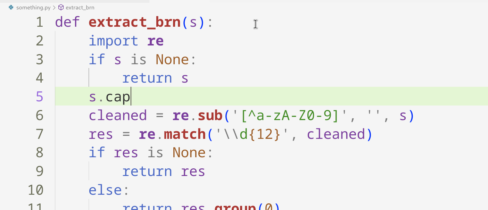
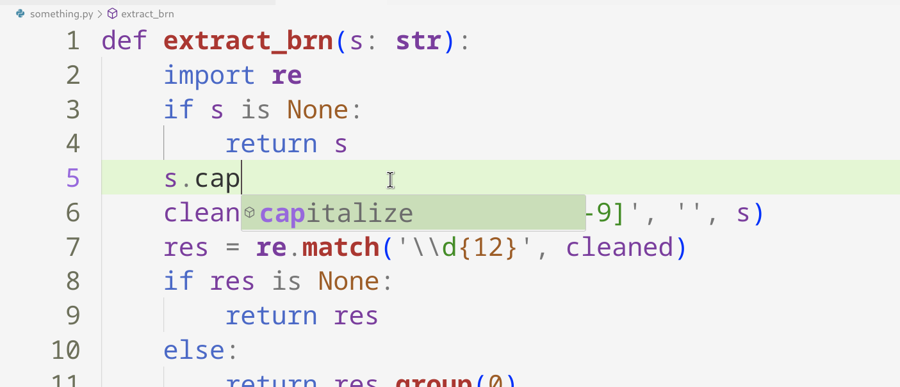

# Type System 0
# Type in programming language?
A type categorizes a set of values

- 1 is an integer; type(1) => int
- The set of integers is {..., -2, -1, 0, 1, 2 , ...}
- The set of strings is {'', 'reimu', 'marisa', ...}
- The set of floats is {1.0, 2.0, 3.0, ...}

# Instant benefit of annotating type
When annotated, modern IDE can do these
- Show documentation when hover over the annotated expression and suggest applicable method for the annotated expression

  

  Without annotation
    
  
    
  Annotated
    
  
    
  showing documentation for string type
- type annotations is better than doc string, also a form of contract between caller and callee.
  
  
  
  Above showing the type signature of `extract_brn` function, writer can read it and call the function legally.
    ```
    extract_brn(123)
    extract_brn(None)
    extract_brn(true)
    ```
  When caller did these above,
  we may assume it will go wrong.
  Because the function `extract_brn` assume its first parameter is string type,
  and if the program break this assumption by passing arguments of different type,
  then the function implementer offer no guarantee in ensure correctness.

# How to get the type of program?
```py
1 : int
```
When read out loud:
> The type of 1 is integer

Below is a rule defined for addition,
```py
e1 : int
e2 : int
----
=> e1 + e2 : int
```
When read out loud:
> The type of addition of augend and addend is integer, if type of augend is integer and type of addend is integer.

If addition expression does not follow rule above, then it considered a type error.

First example,
```py
2 : int
3 : int
---
2 + 3 : int
```

Second example,
```py
2 + 3   :  int # from previous section
5       : int
---
2 + 3 + 5 : int
```

Third example,
```py
'2' : str
3   : int
---
'2' + 3 : error
```

# How knowing type can help you diagnose the problem?

Given the rules and suppositions,
```py
print : ((str, float) -> None)
input : ((str) -> str)

# multiplication
f1 : float
f2 : float
---
f1 * f2 : float

# function call 1
a1 : t1
fn : ((t1) -> t2)
---
fn(a1) => t2

# function call 2
a1 : t1
a2 : t2
fn : ((t1,t2) -> t3)
---
fn(a1,a2) : t3
```

Then, why python complains error for the expression below?
```py
print("Service Tax is:", input('enter a value:')  * 0.06)
```

Let deduce out the type of the expression,

```py
print("Service Tax is:", input('enter a value:')  * 0.06)
| # use function call 2
| "Service Tax is:" : str
| input('enter a value:')  * 0.06
| | # use multiplication
| | input('enter a value:')
| | | # function call 1
| | | input : ((str) -> str)
| | | 'enter a value:' : str
| | input('enter a value:') : str
| | 0.6 : float
| error # because float cannot multiply with str
```

To fix the expression above, casting the input should make the program functional.

# Suggested Reading
- Essentials of Programming Languages by Daniel P. Friedman and Mitchell Wand
- Types and Programming Languages by Benjamin C. Pierce
- The Little Typer by Daniel P. Friedman and David Thrane Christiansen
